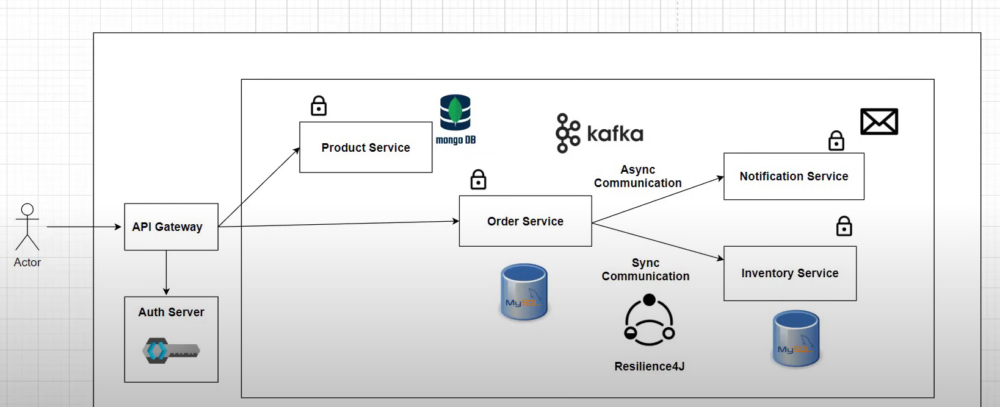
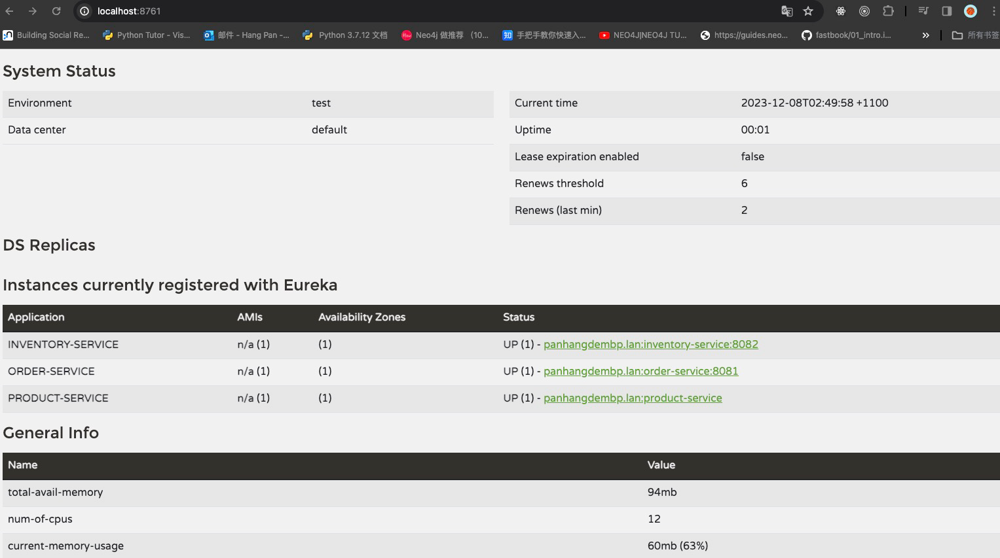
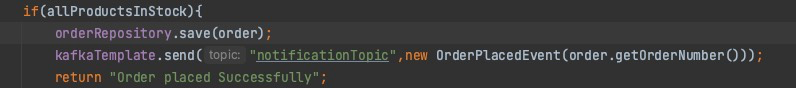
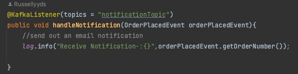

# Description:
This project is a simple online shopping system.   
Using **MircoService** architecture to construct.
This is the bluePrint of the whole Project

##### For OAuth2.0 with keycloak

#### For Service Discovery using **Netflix Eureka**,

To achieve load balancing and middle-tier service failover purposes
improves application availability, scalability, security, and performance.

##### My view:

When the client service is embedded into the code of the program through annotations, etc.
, the client discovery component will register the services it provides with the registration center and periodically send heartbeats to update the service (the default time is 30s, if three consecutive If the service cannot be discovered through heartbeats
, Eureka will remove the service node from the service registry). 
At the same time, the client discovery component will also query the currently registered service information from the server and cache it locally. 
Even if there is a problem with Eureka Server, 
the client component can still call the service node service through the information in the cache. Each service will be called in Rest mode through the registration information of the registration center
, and can be called directly through the service name.

#### Implement API Gateway using Spring Cloud Gateway.

Unified access, traffic control, protocol adaptation, and security maintenance.
Pros:
1. When the client interacts with microservices through the API gateway, the client only needs to know the API gateway address, and does not need to maintain a large number of service addresses, which simplifies client development.
2. The client communicates directly with the API gateway, which can reduce the number of interactions between the client and each service.
3. The service coupling between the client and the backend is reduced.
4. Save traffic, improve performance, and enhance user experience.
5. The API gateway also provides API management functions such as security, flow control, filtering, caching, accounting, and monitoring.

#### Implement Circuit Breaker using  Circuit Breaker Resilience4J
Circuit Breaker Pattern is such a design idea. 
It prevents an application from repeatedly trying an operation that is likely to fail. 
A Circuit Breaker is equivalent to an agent, used to monitor the failure ratio (fail / fail + success) corresponding to a certain operation.
It will decide whether to allow the operation based on the data it receives, or whether to throw an exception immediately.

**Adjust the threshold for configuring fuses based on company business needs**

#### Implement Distributed Tracing using Micrometer
#### em... sleuth may is not suitable in springboot 3, so using Micrometer to do that.
Micrometer (https://micrometer.io) is a project that aims to provide a vendor-neutral application metrics facade. 
Micrometer Tracing sits within the Micrometer suite and is a simple facade over the most popular tracing libraries, 
providing a framework for developers to instrument JVM-based applications without vendor lock-in.

#### Implement Event Driven Architecture with Kafka,using spring-kafka

